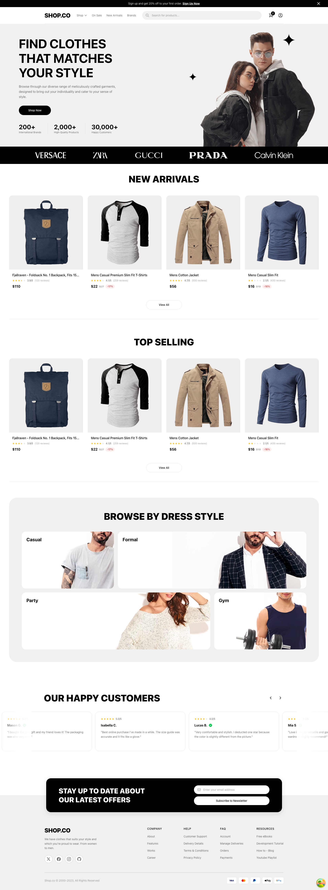
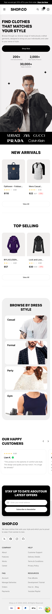
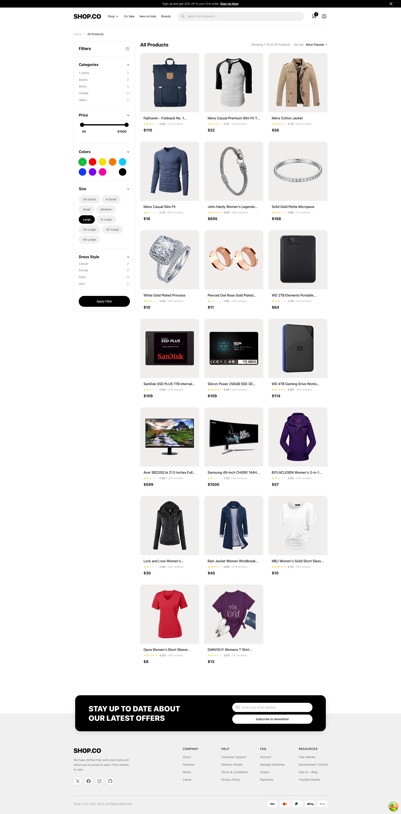
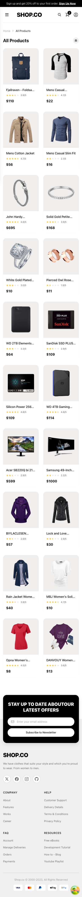
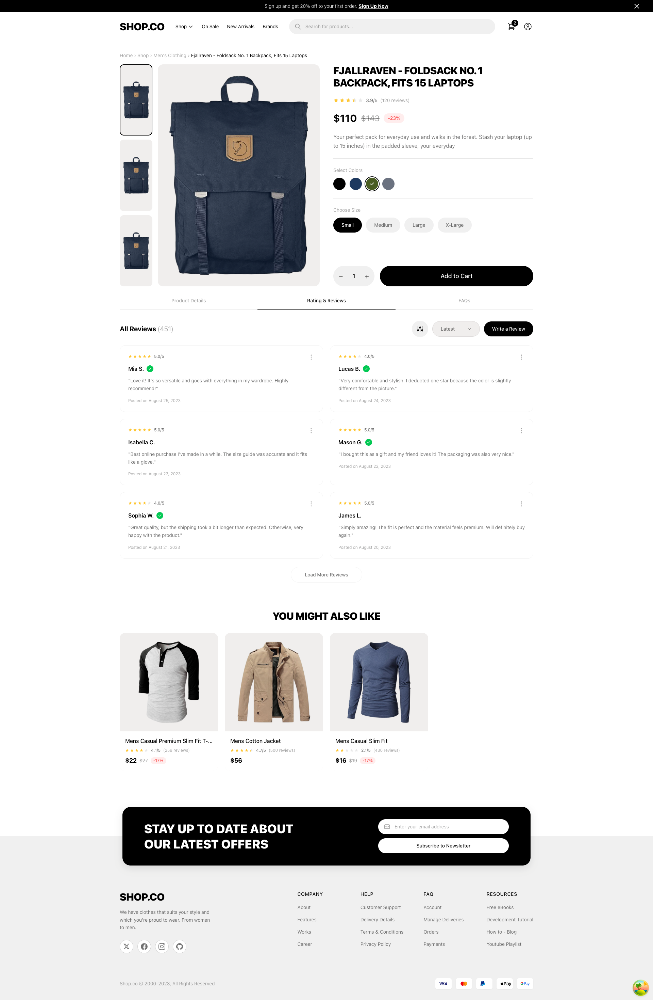
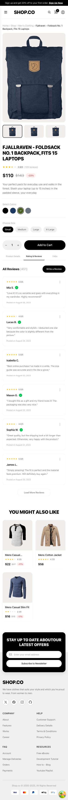
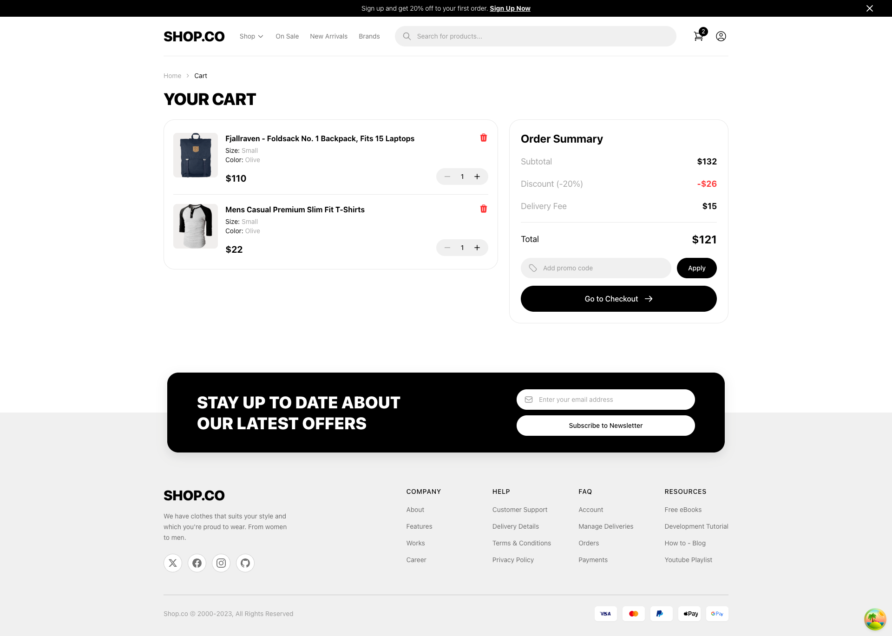
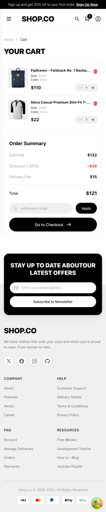

# E-Commerce Case Application

This project is a scalable, performance-driven e-commerce frontend application built with modern web standards, adhering to senior-level architectural patterns. It simplifies the user journey from product discovery to checkout while ensuring code maintainability and efficiency.

## Architectural Design and Patterns

The codebase is structured around **Service-Repository** and **Atomic Design** principles, tailored for a modular frontend environment.

### Service Layer Pattern

API communication is isolated within a dedicated `services` or `api` layer. Components do not make direct fetch calls; instead, they interact with strongly-typed hooks. This abstraction allows for easy testing and potential backend substitutions without refactoring UI components.

### Minimal API Communication

We leverage **TanStack Query** (React Query v5) to drastically reduce network overhead.

- **Aggressive Caching**: Data is cached on the client side to prevent redundant requests.
- **Stale-While-Revalidate**: Users see cached data instantly while background updates occur.
- **Optimistic Updates**: UI interactions (like "Add to Cart") feel instantaneous as the state updates immediately, only rolling back if the server request fails.

### Observer Pattern (State Management)

**Zustand** is employed for global state (e.g., Cart, Filters). Unlike Context API, which triggers re-renders on every update, Zustand uses a selector-based subscription model. Components only re-render when the specific slice of state they "observe" changes.

## Error Handling Strategy

The application implements a robust error handling strategy across three levels to ensure system stability and user feedback.

### Centralized API Management

All HTTP requests are routed through a centralized client (`src/api/client.ts`). This layer intercepts responses and throws standardized errors for non-2xx status codes (e.g., 404, 500), eliminating the need for repetitive status checks in individual components.

### Automated Retry Mechanism

We utilize **React Query**'s built-in resilience features.

- **Retries**: Failed requests are automatically retried 3 times.
- **Exponential Backoff**: The delay between retries increases exponentially to reduce server load during outages.

### UI-Level Resilience

Error states are handled gracefully at the component level.

- **Fallback UI**: Users are presented with friendly error messages instead of white screens.
- **Recovery Actions**: Interfaces provide options to retry operations or navigate back to safety (e.g., "Back to Products").

## Technologies Used

### React 19 & Vite

Used for web application development. Vite handles the build process and development server.

### TypeScript

Used throughout the entire project to ensure type safety.

### TanStack Query (React Query v5)

Used for API requests, cache management, and asynchronous data operations.

### OpenAPI React Query Codegen

Used to automatically generate API clients and query structures.

### Zustand

Used for global state management and cart management.

### Tailwind CSS

Used for UI development and style management.

### React Router v7

Used for web application routing.

### Environment Variables (.env)

Used for environment-based configurations.

## Key Features

### Advanced Client-Side Filtering

The application features a robust client-side filtering system. Users can filter products by category and use a precise price slider (rc-slider) to narrow down choices. These operations are handled instantly on the client side for a responsive experience.

### Mobile-First Design

All pages are responsive. On mobile devices, filters are presented in a bottom sheet/drawer for better usability.

### Persistent Cart

The cart state persists even after page refreshes, managed by Zustand's persist middleware.

### Interactive Product Details

Includes color and size selection, dynamic stock simulation, and tabbed product information.

### Custom Review Carousel

A custom-built carousel component with edge fade effects for displaying customer reviews.

## Visual Showcase

### Home Page

|                                         Desktop                                          |                                         Mobile                                         |
| :--------------------------------------------------------------------------------------: | :------------------------------------------------------------------------------------: |
|  |  |

### Product Listing (Filters & Sort)

|                                             Desktop                                             |                                            Mobile                                             |
| :---------------------------------------------------------------------------------------------: | :-------------------------------------------------------------------------------------------: |
|  |  |

### Product Detail

|                                             Desktop                                             |                                            Mobile                                             |
| :---------------------------------------------------------------------------------------------: | :-------------------------------------------------------------------------------------------: |
|  |  |

### Cart

|                                       Desktop                                        |                                       Mobile                                       |
| :----------------------------------------------------------------------------------: | :--------------------------------------------------------------------------------: |
|  |  |

## Setup and Run

1. Clone the repository.
2. Install dependencies:
   ```bash
   npm install
   ```
3. Ensure the `.env` file is created (check `.env.example`).
4. Start the development server:
   ```bash
   npm run dev
   ```
